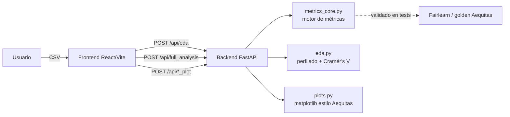

# Manual Técnico
## Herramienta de Medición de Sesgos y Equidad — GobLab UAI

> Documentación para desarrolladores y mantenedores: arquitectura, módulos,
> endpoints, fórmulas de las métricas, ejecución local, pruebas y despliegue.
> El manual de uso funcional está en `MANUAL_USUARIO.md`.

---

## Índice

1. [Arquitectura general](#1-arquitectura-general)
2. [Estructura del repositorio](#2-estructura-del-repositorio)
3. [Backend — módulos](#3-backend--módulos)
4. [Backend — endpoints de la API](#4-backend--endpoints-de-la-api)
5. [Motor de métricas: fórmulas y contrato](#5-motor-de-métricas-fórmulas-y-contrato)
6. [Soporte multiclase (one-vs-rest)](#6-soporte-multiclase-one-vs-rest)
7. [Módulo EDA](#7-módulo-eda)
8. [Frontend — estructura y flujo de datos](#8-frontend--estructura-y-flujo-de-datos)
9. [Ejecución local](#9-ejecución-local)
10. [Pruebas](#10-pruebas)
11. [Despliegue](#11-despliegue)
12. [Decisiones de diseño](#12-decisiones-de-diseño)
13. [Cómo extender la herramienta](#13-cómo-extender-la-herramienta)

---

## 1. Arquitectura general

La herramienta son **dos aplicaciones independientes**:

- **Backend**: API REST en **FastAPI** (Python). Calcula las métricas de sesgo y
  equidad con un motor propio (`metrics_core`, basado en pandas/numpy/scipy) y el
  perfilado exploratorio (`eda`). Genera los gráficos del análisis con matplotlib.
- **Frontend**: SPA en **React + TypeScript + Vite + Tailwind**. Sube el CSV,
  muestra el EDA (con **Recharts**), la configuración y los resultados.



**Principio de diseño clave:** el backend **no entrena modelos**; recibe
predicciones y valores reales ya calculados y los audita. El motor de métricas es
propio (no depende de Aequitas), se valida en pruebas contra Aequitas 1.0.0 (test
"golden") y contra **Fairlearn**.

---

## 2. Estructura del repositorio

```
SesgosyEquidad/
├── backendBiasTool/
│   ├── api/
│   │   ├── main.py            # App FastAPI + endpoints + serialización
│   │   ├── metrics_core.py    # Motor de métricas (sin Aequitas)
│   │   ├── eda.py             # Análisis exploratorio (perfilado, Cramér's V)
│   │   ├── bias_analysis.py   # Orquestación + gráficos de distribución/análisis
│   │   ├── plots.py           # Gráficos matplotlib estilo Aequitas (barras, treemap)
│   │   └── tests/             # pytest (metrics_core, api, plots, multiclass, eda)
│   ├── requirements.txt       # Dependencias de producción
│   ├── requirements-dev.txt   # + pytest, httpx, fairlearn
│   ├── Dockerfile             # python:3.12-slim
│   ├── pytest.ini
│   └── docs/DECISIONES.md     # Registro de decisiones de arquitectura
├── frontendBiasTool/
│   ├── src/
│   │   ├── components/        # UI (ToolView, EquidadTabContent, eda/…, FeedbackButton,
│   │   │                      #     MetricSelectorTree, SectionHeader, SatisfactionSurvey, IntroGuide)
│   │   ├── hooks/             # useAnalysis, useEda, useFileUpload, useAnalysisState
│   │   ├── lib/               # vizPalette, analytics, pdfReport, referenceInfo
│   │   ├── types/index.ts     # Tipos (ColumnSelection, EdaResult, …)
│   │   └── constants/index.ts # Traducciones y catálogos de métricas
│   ├── public/images/         # Logos (GobLab/UAI, ANID)
│   ├── tailwind.config.js     # Sistema de diseño "Civic Rose" (paleta + fuentes)
│   ├── vite.config.ts         # dedupe de React, optimizeDeps
│   └── package.json
└── docs/manual/               # Este manual + dataset demo + imágenes
```

---

## 3. Backend — módulos

### `metrics_core.py` — el motor
Cálculo puro en `pandas`/`numpy`/`scipy`, sin dependencias de fairness pesadas.
Funciones principales:

| Función | Responsabilidad |
|---|---|
| `get_crosstabs(df, attrs, score_col, label_col)` | Conteos (VP/FP/VN/FN…) y las 12 métricas absolutas por subgrupo. |
| `_absolute_metrics(xtab)` | Deriva las tasas de la matriz 2×2 (división por cero → `NaN`). |
| `_reference_rows(xtab, ref_method, ref_groups, perf)` | Elige el grupo de referencia (majority/minority/custom/best_performance). |
| `get_disparity(xtab, ref_map, …)` | Disparidades vs. una referencia única por atributo. |
| `get_disparity_min_metric(xtab, …)` | Disparidades con referencia **por métrica** (réplica de `Bias.get_disparity_min_metric`). |
| `_apply_parity(bias_df, tau, min_group_size)` | Marca Fair/Unfair por métrica; `fairness_conclusion`; `insufficient_sample`. |
| `_fairness_summary`, `get_group_attribute_fairness` | Agregación por atributo (ignora muestra insuficiente). |
| `run_full_analysis(...)` | Orquesta todo; detecta binario vs. multiclase. |
| `recalculate_fairness(bias_df, tau, min_group_size)` | Recalcula solo paridades con nuevo umbral. |
| `_detect_task`, `_binarize_ovr`, `_run_binary_tables`, `_fairness_overall` | Soporte multiclase (ver §6). |

### `eda.py` — análisis exploratorio
`run_eda(df, min_group_size)` devuelve JSON: perfil por columna, matriz de
asociación (Cramér's V corregido), tablas de contingencia precomputadas y alertas.
Ver §7.

### `bias_analysis.py` — orquestación + visualización
- `run_full_analysis(...)`: envuelve a `metrics_core.run_full_analysis` y añade
  `distribution_plots` y el gráfico de disparidad inicial (por clase si es multiclase).
- `generate_distribution_plots(...)`: `countplot` de predicción/valor real por subgrupo.
- `render_absolute_plot`, `render_disparity_plot`: delegan en `plots.py`.
- Reexporta `recalculate_fairness` desde `metrics_core`.

### `plots.py` — gráficos estilo Aequitas
Matplotlib puro (sin Aequitas):
- `render_group_metric_plot`: barras horizontales de una métrica por subgrupo,
  agrupadas por atributo y coloreadas por tamaño de grupo.
- `render_disparity_treemap`: cuadrícula de treemaps de disparidad con grupo de
  referencia "(Ref)", escala divergente centrada en 1 y algoritmo `_squarify` propio.

### `main.py` — API y serialización
Define la app FastAPI, el CORS, los endpoints (§4) y utilidades:
- `read_csv_robust`: lee CSV con fallback de codificación (utf-8 → latin1).
- `translate_df`: traduce nombres de columnas de tablas al español.
- `to_records`: DataFrame → lista de dicts con **`NaN → None`** (JSON válido para el navegador).
- `serialize_tables`: serializa el dict de tablas (reutilizable para binario y por clase).

---

## 4. Backend — endpoints de la API

Base URL por defecto: `http://127.0.0.1:8000`. CORS abierto (`*`).

| Método | Ruta | Entrada | Salida |
|---|---|---|---|
| `GET` | `/api/health` | — | `{"status":"ok"}` |
| `POST` | `/api/preview` | `file` (CSV, multipart) | `{columns, preview}` (5 filas) |
| `POST` | `/api/eda` | `file`, `params?` (JSON: `minGroupSize`) | Perfil EDA (§7) |
| `POST` | `/api/full_analysis` | `file`, `columns` (JSON), `params?` (JSON) | Tablas + metadata (§5) |
| `POST` | `/api/rerender_plot` | JSON `{bias_metrics, metrics[], attributes[]}` | `{plot}` (data URI PNG) |
| `POST` | `/api/absolute_plot` | JSON `{group_metrics_for_plotting, metric, attribute}` | `{plot}` |
| `POST` | `/api/group_metric_plot` | JSON `{group_metrics, metric, attribute}` | `{plot}` |
| `POST` | `/api/recalculate_fairness` | JSON `{bias_metrics, fairnessThreshold, minGroupSize}` | `{fairness_summary, fairness_by_attribute}` |

**`columns`** (para `full_analysis`):
```json
{ "predictions": "prediccion", "actual": "reincidio",
  "protected": ["etnia", "sexo", "rango_edad"] }
```

**`params`** (para `full_analysis`, todos opcionales):
```json
{ "referenceMethod": "majority",        // majority | minority | custom | best_performance
  "referenceGroups": {"etnia": "Caucásico"},   // requerido si custom
  "performanceMetric": "fpr",           // para best_performance
  "fairnessThreshold": 1.25,            // umbral τ (también acepta fairness_threshold)
  "minGroupSize": 50 }                  // muestra mínima
```

**Respuesta de `full_analysis` (binario)**:
```jsonc
{
  "distribution_plots": { "<attr>": {"score_plot": "data:image/png;base64,…", "label_plot": "…"} },
  "plots": { "disparity_summary": "data:image/png;base64,…" },
  "tables": {
    "group_counts": [ … ],                 // traducida
    "group_metrics": [ … ],                // traducida
    "group_metrics_for_plotting": [ … ],   // cruda (nombres en inglés)
    "bias_metrics": [ … ],                 // cruda (disparidades, paridades, insufficient_sample)
    "fairness_summary": [ … ]              // traducida
  },
  "metadata": { "protected_attributes": [...], "unique_values": {...},
                "fairness_threshold": 1.25, "min_group_size": 50, "task_type": "binary",
                "ref_method": "majority", "performance_metric": "fpr" }
}
```

> `metadata.ref_method` y `metadata.performance_metric` se exponen para que la UI y
> el PDF puedan mostrar con qué criterio se eligió el grupo de referencia. El grupo
> concreto por atributo se deriva en el frontend desde las columnas
> `<metrica>_ref_group_value` de `bias_metrics` (`src/lib/referenceInfo.ts`).
En **multiclase** se añaden `by_class` (tablas por clase, forma binaria) y
`fairness_overall`, y `metadata.task_type="multiclass"` + `metadata.classes` (§6).

---

## 5. Motor de métricas: fórmulas y contrato

Todo parte de la **matriz de confusión 2×2 por subgrupo**:

| | real = 1 | real = 0 |
|---|---|---|
| pred = 1 | VP (tp) | FP (fp) |
| pred = 0 | FN (fn) | VN (tn) |

**Métricas absolutas** (12; división por cero → `NaN`, replicando Aequitas):

| Métrica | Fórmula |
|---|---|
| TPR (sensibilidad) | tp / (tp + fn) |
| TNR (especificidad) | tn / (tn + fp) |
| FPR | fp / (fp + tn) |
| FNR | fn / (fn + tp) |
| Precisión (PPV) | tp / (tp + fp) |
| FDR | fp / (tp + fp) |
| FOR | fn / (tn + fn) |
| NPV | tn / (tn + fn) |
| Prevalencia (prev) | (tp + fn) / group_size |
| Prev. predicha (pprev) | pp / group_size |
| Exactitud | (tp + tn) / group_size |
| PPR | pp / Σ(pp del mismo atributo) |

**Disparidad** de una métrica `m`: `m_disparity = m_subgrupo / m_referencia`.
El grupo de referencia tiene disparidad `1.00`. Aequitas (y este motor) generan
**10 disparidades** (ppr, pprev, precision, fdr, for, fpr, fnr, tpr, tnr, npv);
no `accuracy_disparity`.

**Grupo de referencia** (`_reference_rows`):
- `majority`/`minority`: mayor/menor `group_size`.
- `custom`: valor indicado por el usuario.
- `best_performance`: referencia **por métrica** = grupo con el mínimo valor de esa
  métrica (usa `get_disparity_min_metric`).

**Paridad y regla de equidad** (`_apply_parity`):
- `Fair` si la disparidad es `NaN` o cae en `[1/τ, τ]` (τ = `fairness_threshold`,
  por defecto 1.25 ≈ regla del 80%). Un valor infinito queda fuera → `Unfair`.
- **`fairness_conclusion`** (conclusión del subgrupo) se basa en las métricas de
  **error** `FPR, FNR, FOR, FDR` (constante `FAIRNESS_CONCLUSION_METRICS`): `Unfair`
  si **cualquiera** supera τ. *No* se usa la Paridad Estadística (ppr), que depende
  del tamaño del grupo. (Ver decisión D5.)
- **Muestra mínima** (`min_group_size`, default 50): los subgrupos con
  `group_size < min_group_size` se marcan `insufficient_sample = True` y **no**
  determinan el veredicto del atributo (con *fallback*: si todos son insuficientes,
  se evalúan igual). (Ver decisión D8.)

**Contrato de columnas.** Los nombres de columna de las tablas se preservan
idénticos a los de Aequitas (para no romper el frontend). Congelado en los
`fixtures/golden_*.csv` del test.

---

## 6. Soporte multiclase (one-vs-rest)

`_detect_task(label, score)` decide:
- **binario** si hay ≤2 valores y son numéricos `{0,1}`.
- **multiclase** en cualquier otro caso (>2 clases, o 2 clases no numéricas).

En multiclase, para **cada clase `c`** se binariza *c vs. resto* (`_binarize_ovr`)
y se reutiliza el núcleo binario (`_run_binary_tables`). La respuesta añade:
- `tables`: concatenadas con una columna **`class`**.
- `by_class[c]`: `{ tables: {...forma binaria...}, plots: {...} }` (lo que consume el frontend).
- `fairness_overall`: por atributo, `Unfair` si lo es en **alguna** clase.
- `metadata.classes` y `metadata.task_type = "multiclass"`.

El **caso binario permanece idéntico** (sin `by_class` ni columna `class`).

---

## 7. Módulo EDA

`run_eda(df, min_group_size)` devuelve:

```jsonc
{
  "n_rows", "n_cols", "missing_cells_pct",
  "columns": [ { "name", "dtype", "missing", "missing_pct", "unique",
                 "top_values", "categorical_like", "role_hint",
                 "stats"?, "histogram"?, "balance"? } ],
  "associations": { "columns": [...], "matrix": [[...]] },   // Cramér's V
  "crosstabs": { "a|||b": {x_values, y_values, counts} },     // precomputadas
  "crosstab_columns": [...],
  "alerts": [ { "level", "type", "columns", "message" } ],
  "min_group_size"
}
```

Detalles de implementación:
- **`cramers_v(x, y)`**: Cramér's V con corrección de Bergsma (`scipy.stats.chi2_contingency`).
- **`_normalized_entropy`**: índice de balance (0 = concentrado, 1 = uniforme).
- **`_role_hint`**: heurística de rol (outcome/protected/id/feature).
- **Crosstabs**: se precomputan **todos los pares** de columnas categórico-like para
  que las vistas bivariadas del frontend no requieran re-subir el CSV.
- **Alertas**: nulos, alta cardinalidad, columna constante, desbalance, muestra
  pequeña y **proxy** (Cramér's V ≥ 0.5).

---

## 8. Frontend — estructura y flujo de datos

**Stack:** React 18 + TypeScript + Vite 5 + Tailwind 3 + Recharts 2 + lucide-react.

**Flujo de estado (hooks):**
- `useAnalysisState`: estado central (`file`, `previewData`, `results`, `columnSelection`, `fairnessThreshold`).
- `useFileUpload`: `POST /api/preview` al cargar el CSV.
- `useEda`: `POST /api/eda`; expone `{eda, edaLoading, edaError, runEda}`.
- `useAnalysis`: `POST /api/full_analysis` y `recalculate_fairness`; guarda la respuesta en `results`.

**Componentes clave:**
- `ToolView`: orquesta el flujo (carga → EDA → configuración → resultados). Para
  **multiclase**, deriva `effectiveResults = by_class[claseSeleccionada]` para que
  las pestañas de resultados no cambien su lógica.
- `components/eda/`: `EdaPanel` (4 pestañas) + `AssociationHeatmap`,
  `DistributionExplorer`, `BivariateExplorer`, `IntersectionHeatmap`, `ColumnCard`.
- `SesgosTabContent` / `EquidadTabContent`: tablas (`DataTable`) y gráficos
  (`AbsolutePlotter`, `DisparityPlotter` → `PlotVisualization` con `` base64).

**Visualización:** `src/lib/vizPalette.ts` contiene la paleta validada (azul
secuencial para heatmaps, slots categóricos, colores de estado). Los gráficos del
**análisis** (barras, treemap) se renderizan **en el backend** (PNG); los del
**EDA** se renderizan **en el cliente** con Recharts.

> Nota: `recharts` está fijado a la línea **2.x**. La 3.x arrastra react-redux y,
> con React 18 + Vite dev, provoca "Invalid hook call / more than one copy of
> React". `vite.config.ts` deduplica React (`resolve.dedupe`).

### 8.1 Sistema de diseño "Civic Rose"

Identidad visual compartida con la Herramienta de Evaluación de Impacto (EIA),
definida en `tailwind.config.js`:
- **Paleta:** burdeos `#7A3B48`, rosa `#C08A93`, rose-tint `#F4E4E7`, paper
  `#FAF7F4`, line `#E5DFD7`, escala `ink` y estados `success #2F6B4F` / `warn`.
  La escala `indigo` de Tailwind se **remapea** a tonos burdeos/rosa, de modo que
  todo acento existente (`bg-indigo-*`) adopta la identidad sin editar cada clase.
- **Tipografía:** Fraunces (títulos, `font-display`), Inter (cuerpo), JetBrains
  Mono (etiquetas/eyebrows). `SectionHeader` encapsula el patrón eyebrow + título.

### 8.2 Asistente de métrica y grupo de referencia

- **`MetricSelectorTree`**: árbol de decisión interactivo (Paso 2) que sugiere la
  métrica a observar; su recomendación se guarda en `ToolView` y se pasa al PDF.
- **`lib/referenceInfo.ts`**: deriva, por atributo, el grupo de referencia desde
  `bias_metrics` (`<metrica>_ref_group_value`) y etiqueta el método. Lo consumen
  `EquidadTabContent` (panel "¿Contra qué se compara cada grupo?"), la marca
  **"(ref)"** de la tabla de disparidades y `FairnessAnalysis` (vista previa del
  grupo de referencia antes de "Analizar Equidad", que replica la lógica del
  backend: mayoritario, personalizado, y `best_performance` por métrica).

### 8.3 Informe PDF (`lib/pdfReport.ts`)

`generatePdfReport(results, BASE_API_URL, recommendedMetric?, eda?)` con `jspdf` +
`jspdf-autotable`, **importado dinámicamente** (code-splitting) para no inflar el
bundle. Genera: página inicial de **EDA** (panorama, alertas, roles), métrica
recomendada, resumen (incl. método de referencia), resumen de equidad, **grupo de
referencia por atributo**, disparidades con fila **"(ref)"** y los gráficos
(vía `POST /api/absolute_plot` y `/api/rerender_plot`). Estilo Civic Rose.

### 8.4 Analítica y feedback (Supabase / GA4)

`lib/analytics.ts` centraliza los eventos GA4 y la escritura a **Supabase** (REST,
`apikey`/`Bearer` con la *anon key* pública):
- `registerToolUser(email, origin?)` → tabla `tool_users` (columnas `email`,
  `tool_name`, `origin`). En la portada, `origin` combina *"origen · tipo de
  usuario"* (la tabla solo tiene una columna `origin`). El registro se envía
  **solo si la persona marca el consentimiento**; si no, igual entra.
- `submitFeedback(...)` (botón flotante `FeedbackButton`) y
  `submitSatisfactionSurvey(...)` (`SatisfactionSurvey`, mostrada **solo al
  descargar el PDF**, con opción "Omitir y descargar") → tabla **compartida
  `tool_feedback`** (columnas `tool, feedback_type, description, email, pantalla`).
  La columna `email` es NOT NULL: si la persona no deja correo se usa
  `anonimo@goblab.cl`. Falla en silencio para no interrumpir el flujo.

Variables de entorno del frontend: `VITE_BASE_API_URL`, `VITE_SUPABASE_URL`,
`VITE_SUPABASE_ANON_KEY`, `VITE_GA_MEASUREMENT_ID` (todas se sustituyen en build).

---

## 9. Ejecución local

### Backend
```bash
cd backendBiasTool
python -m venv .venv && source .venv/bin/activate   # Python 3.12+
pip install -r requirements-dev.txt                 # incluye pytest, fairlearn
uvicorn api.main:app --host 127.0.0.1 --port 8000
```

### Frontend
```bash
cd frontendBiasTool
npm install
# apunta el frontend al backend local:
echo 'VITE_BASE_API_URL=http://127.0.0.1:8000' > .env.local
npm run dev -- --host 127.0.0.1 --port 5173
```
Abre `http://localhost:5173`. El archivo de demo está en
`docs/manual/datos_demo_compas_es.csv`.

---

## 10. Pruebas

```bash
cd backendBiasTool
pytest            # 47 pruebas
```

Suites (`api/tests/`):
- **`test_metrics_core.py`**: golden COMPAS contra Aequitas 1.0.0 real, validación
  cruzada con **Fairlearn** (`MetricFrame`), estrategias de referencia, muestra
  mínima, idempotencia de `recalculate_fairness`, contrato de columnas.
- **`test_multiclass.py`**: detección de tarea, estructura `by_class`, equivalencia
  OvR vs. binarización manual, `fairness_overall`.
- **`test_eda.py`**: perfilado, Cramér's V, detección de proxy, histograma, balance,
  role_hint, crosstabs, endpoint.
- **`test_api.py`**: smoke de endpoints, JSON estricto (sin `NaN`).
- **`test_plots.py`**: los gráficos se generan sin error.

Los *fixtures* golden (`api/tests/fixtures/golden_*.csv`) se generaron una vez con
Aequitas 1.0.0 (Python 3.11, aislado) y congelan el comportamiento de referencia.

---

## 11. Despliegue

**Backend** — imagen Docker ligera (`python:3.12-slim`, sin `build-essential`
gracias a que ya no se usa Aequitas):
```bash
cd backendBiasTool
docker build -t bias-backend .
docker run -p 8000:8000 bias-backend
```

**Frontend** — build estático servido por Nginx (ver su `Dockerfile`), con la
variable `VITE_BASE_API_URL` apuntando al backend en tiempo de build:
```bash
cd frontendBiasTool
npm run build          # genera dist/
```

> El informe PDF (`jspdf` + `autotable`) se carga con **import dinámico**, así que
> queda fuera del bundle principal (code-splitting). El frontend se sirve con Nginx
> (gzip + fallback SPA); ambos `Dockerfile` están optimizados (usuario no-root,
> `HEALTHCHECK`, `.dockerignore`, `npm ci`).

---

## 12. Decisiones de diseño

Registradas en `backendBiasTool/docs/DECISIONES.md`. Resumen:

| # | Decisión |
|---|---|
| D1 | Reemplazar Aequitas por motor propio + Fairlearn (solo en tests). |
| D2 | Preservar el contrato de columnas de Aequitas. |
| D3 | Semántica del grupo de referencia (incl. min-metric por métrica). |
| D4 | Regla de equidad `[1/τ, τ]` (regla del 80%). |
| D5 | `fairness_conclusion` basada en FPR/FNR/FOR/FDR (no en ppr). |
| D6 | Gráficos del análisis en matplotlib estilo Aequitas (`plots.py`). |
| D7 | Multiclase one-vs-rest. |
| D8 | Muestra mínima + tolerancia como multiplicador `×`. |
| D9 | Módulo EDA (Cramér's V, alertas, crosstabs) con render en cliente. |
| D10 | Identidad visual "Civic Rose" compartida con la EIA (Tailwind + fuentes). |
| D11 | Feedback y encuesta de satisfacción a Supabase (`tool_feedback`); encuesta solo al descargar el PDF. |
| D12 | Informe PDF con `jspdf` (import dinámico) incluyendo página de EDA, grupo de referencia y métrica recomendada. |

---

## 13. Cómo extender la herramienta

- **Nueva métrica absoluta**: añádela en `_absolute_metrics` y a `ABSOLUTE_METRICS`.
  Si debe tener disparidad, agrégala a `DISPARITY_METRICS` y a `PARITY_MAPPING`.
- **Cambiar las métricas del veredicto**: edita `FAIRNESS_CONCLUSION_METRICS`.
- **Nueva alerta de EDA**: añade la lógica en el bucle por columna de `run_eda`
  (o en el bloque de asociaciones) empujando a `alerts`.
- **Nuevo gráfico de EDA**: crea un componente en `src/components/eda/` que consuma
  `EdaResult` (o `crosstabs`) y añádelo a una pestaña de `EdaPanel`.
- **Umbral de muestra mínima configurable en UI**: expón `minGroupSize` como control
  y pásalo en `params` a `/api/full_analysis` y `/api/eda`.
- **Multiclase en la UI del análisis**: ya soportado vía el selector de clase de
  `ToolView` (`effectiveResults`).

---

*GobLab UAI — Escuela de Gobierno, Universidad Adolfo Ibáñez.*
