# Manual de Usuario
## Herramienta de Medición de Sesgos y Equidad — GobLab UAI

> Guía paso a paso para usar la herramienta, interpretar cada gráfico y tabla, y
> decidir en qué métricas enfocarte. Todos los ejemplos usan el archivo de
> demostración **`datos_demo_compas_es.csv`** (versión en español del dataset
> COMPAS de reincidencia delictiva), incluido en esta misma carpeta.

---

## Índice

1. [¿Qué es esta herramienta y para qué sirve?](#1-qué-es-esta-herramienta-y-para-qué-sirve)
2. [Conceptos clave (glosario)](#2-conceptos-clave-glosario)
3. [Prepara tus datos](#3-prepara-tus-datos)
4. [El flujo de trabajo de un vistazo](#4-el-flujo-de-trabajo-de-un-vistazo)
5. [Paso 1 — Cargar el archivo](#5-paso-1--cargar-el-archivo)
6. [Paso 2 — Análisis Exploratorio (EDA)](#6-paso-2--análisis-exploratorio-de-los-datos-eda)
7. [Paso 3 — Configuración del análisis](#7-paso-3--configuración-del-análisis)
8. [Paso 4 — Análisis de Sesgos](#8-paso-4--análisis-de-sesgos)
9. [Paso 5 — Análisis de Equidad](#9-paso-5--análisis-de-equidad)
10. [Guía de métricas: cuándo usar cada una](#10-guía-de-métricas-cuándo-usar-cada-una)
11. [Descargar el informe (PDF) y dar tu opinión](#11-descargar-el-informe-pdf-y-dar-tu-opinión)
12. [Modelos multiclase](#12-modelos-multiclase)
13. [En qué enfocarte: buenas prácticas y errores comunes](#13-en-qué-enfocarte-buenas-prácticas-y-errores-comunes)
14. [Preguntas frecuentes](#14-preguntas-frecuentes)

---

## 1. ¿Qué es esta herramienta y para qué sirve?

Es una herramienta web que **mide el sesgo algorítmico** de un modelo de
clasificación (por ejemplo, un modelo que predice riesgo de reincidencia,
deserción escolar, o elegibilidad para un beneficio). No entrena modelos: **audita
las predicciones que ya generó tu modelo**, comparando cómo se comporta entre
distintos grupos de personas.

**¿Para quién?** Equipos de ciencia de datos del sector público que necesitan
verificar que un modelo no discrimina de forma arbitraria.

**Marco legal (Chile).** La **Ley N.º 20.609** establece 16 categorías protegidas
frente a la discriminación arbitraria (raza/etnia, sexo, edad, situación
socioeconómica, religión, orientación sexual, discapacidad, etc.). Esta
herramienta te ayuda a evaluar si tu modelo trata de forma equitativa a esos
grupos, en línea con la guía *"Permitido Innovar"*.

**Idea central.** Un modelo puede tener buena precisión global y aun así
**cometer sus errores de forma desigual** entre grupos. Por ejemplo, marcar de más
como "reincidentes" a un grupo étnico. Esta herramienta cuantifica esas diferencias.

---

## 2. Conceptos clave (glosario)

| Término | Qué significa |
|---|---|
| **Predicción del modelo** | La columna con lo que tu modelo predijo (0/1). En el demo: `prediccion` (1 = el modelo predice que la persona reincidirá). |
| **Valor real** | La columna con lo que realmente pasó (0/1). En el demo: `reincidio` (1 = efectivamente reincidió). |
| **Variable protegida** | El atributo demográfico sobre el que evalúas la equidad (etnia, sexo, edad…). |
| **Subgrupo** | Cada valor de una variable protegida (p. ej. dentro de `etnia`: Afroamericano, Caucásico…). |
| **Grupo de referencia** | El subgrupo contra el que se comparan los demás. Todas las disparidades se miden respecto a él. |
| **Disparidad** | Cociente entre la métrica de un subgrupo y la del grupo de referencia. **1.00 = sin diferencia.** |
| **Tolerancia (τ)** | Cuánta disparidad aceptas antes de declarar "inequitativo". `1.25×` = la regla del 80% (se tolera ±25%). |
| **Muestra mínima** | Subgrupos con muy pocos casos (por defecto <50) se marcan "muestra insuficiente" y no deciden el veredicto, porque sus tasas son poco fiables. |
| **Proxy** | Una variable que, sin ser la protegida, está tan asociada a ella que la "esconde" (p. ej. la comuna puede ser proxy del nivel socioeconómico). |

**La matriz de confusión** (base de todas las métricas), calculada **por cada
subgrupo**:

|  | Reincidió (real = 1) | No reincidió (real = 0) |
|---|---|---|
| **Modelo predice 1** | Verdadero Positivo (VP) | **Falso Positivo (FP)** |
| **Modelo predice 0** | **Falso Negativo (FN)** | Verdadero Negativo (VN) |

- Un **Falso Positivo** aquí = predecir que alguien reincidirá cuando **no** lo hace (castigo injusto).
- Un **Falso Negativo** = no predecir reincidencia cuando **sí** ocurre.

---

## 3. Prepara tus datos

Tu archivo debe ser un **CSV** con, al menos, tres tipos de columna:

1. **Predicción del modelo** — binaria (`0`/`1`) o, para modelos multiclase, con más categorías.
2. **Valor real** — el resultado observado, en el mismo formato.
3. **Una o más variables protegidas** — categóricas (etnia, sexo, edad…).

**Reglas importantes:**
- Las variables protegidas deben ser **categóricas** (texto o pocas categorías). Columnas continuas (ingresos exactos, edad en años) conviene agruparlas en rangos.
- Evita valores faltantes en las columnas clave.
- Una columna identificador (`id`) es opcional y se ignora en el análisis.

**Archivo de demostración** (`datos_demo_compas_es.csv`, 7.214 filas):

| id | prediccion | reincidio | etnia | sexo | rango_edad |
|---|---|---|---|---|---|
| 1 | 0 | 0 | Otro | Masculino | Mayor de 45 |
| 5 | 1 | 0 | Afroamericano | Masculino | Menor de 25 |
| … | | | | | |

---

## 4. El flujo de trabajo de un vistazo

```
Cargar CSV  →  EDA (explorar)  →  Configurar  →  Análisis de Sesgos  →  Análisis de Equidad
              (4 pestañas)        (columnas +      (tablas +             (disparidades +
                                   tolerancia)      valores por grupo)    veredicto de equidad)
```

Cada paso se explica en detalle a continuación.

---

## 5. Paso 1 — Cargar el archivo

En la **portada** verás una introducción con el flujo en 4 pasos y las 4 métricas
clave.

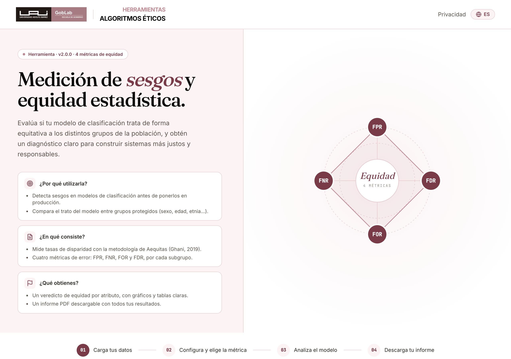

**Formulario de inicio ("Comienza tu evaluación").** Debajo del correo (opcional)
puedes indicar **desde dónde participas** (tipo de institución) y tu **tipo de
usuario** (rol). Estos datos son **opcionales** y nos ayudan a entender quién usa
la herramienta.

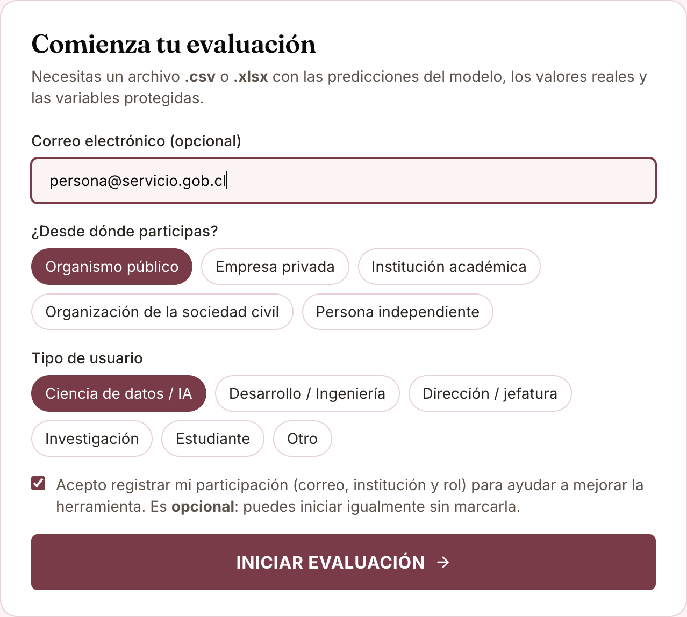

- Si marcas la casilla **"Acepto registrar mi participación"**, al pulsar
  **"Iniciar Evaluación"** se guarda tu registro (correo, institución y rol).
- Si **no** la marcas, igual entras a la herramienta: el registro es **opcional**
  y no condiciona el uso.

Tras iniciar, arrastra o selecciona tu archivo CSV en el área de carga. En cuanto
se carga, la herramienta:
- Lee una vista previa de las columnas (para el paso de configuración).
- Ejecuta automáticamente el **Análisis Exploratorio (EDA)**, que aparece justo debajo.

> **Botón "Enviar feedback".** En la esquina inferior derecha, en cualquier
> momento, hay un botón flotante para dejar un comentario o reportar un error.
> Es distinto de la encuesta de satisfacción (que aparece al descargar el informe).

---

## 6. Paso 2 — Análisis Exploratorio de los Datos (EDA)

**Objetivo:** entender tus datos y detectar problemas **antes** de medir la
equidad. Un dato mal balanceado o un proxy oculto puede invalidar todo el análisis.
El EDA se organiza en **cuatro pestañas**.

### 6.1 Pestaña «Resumen»

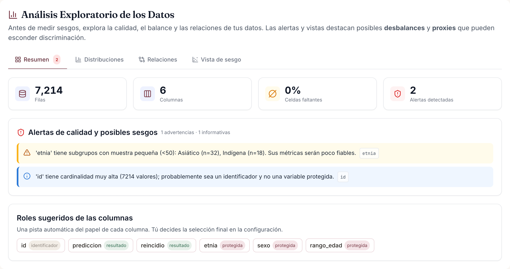

- **Tarjetas superiores:** número de filas, columnas, % de celdas faltantes y
  número de alertas detectadas.
- **Alertas de calidad y posibles sesgos** — el corazón del EDA. Cada alerta tiene
  color según su gravedad:
  - 🔴 **Crítica** (rojo): p. ej. una columna con >20% de datos faltantes.
  - 🟠 **Advertencia** (ámbar): subgrupos con muestra pequeña, categoría dominante (desbalance), proxy fuerte.
  - 🔵 **Informativa** (azul): p. ej. una columna que parece un identificador.
  - En el demo verás: *"'etnia' tiene subgrupos con muestra pequeña (<50): Asiático (n=32), Indígena (n=18)"* y *"'id' tiene cardinalidad muy alta… probablemente sea un identificador"*.
- **Roles sugeridos:** una pista automática de qué es cada columna (resultado,
  protegida, identificador). **Es solo una sugerencia**; tú decides en la configuración.

**En qué enfocarte:** lee todas las alertas. Los subgrupos con muestra pequeña y
los proxies son los que más pueden distorsionar (o esconder) un sesgo.

### 6.2 Pestaña «Distribuciones»

Muestra cómo se reparten los valores de cada variable.

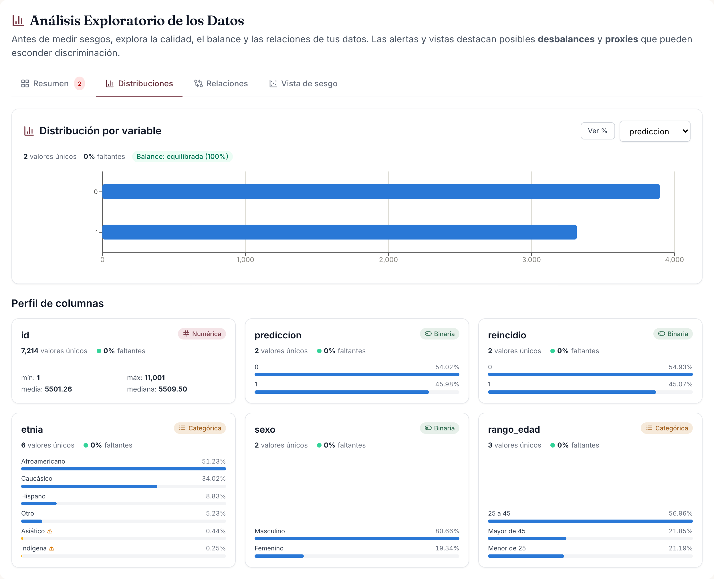

- Selecciona una variable en el desplegable; alterna entre **conteo** y **%**.
- Para variables categóricas verás barras por categoría; para numéricas, un histograma.
- El **badge de balance** indica si la variable está *equilibrada*, *moderada* o
  *desbalanceada* (basado en la entropía). Una variable muy desbalanceada tendrá
  grupos minoritarios difíciles de evaluar.
- Las barras **ámbar** son subgrupos con muestra pequeña (<50 casos).
- Abajo, el **Perfil de columnas** resume cada columna (tipo, % faltantes,
  cardinalidad y su mini-distribución).

**En qué enfocarte:** revisa que cada variable protegida tenga grupos con
suficientes casos. En el demo, `etnia` está *moderada*: Afroamericano y Caucásico
dominan, mientras Asiático (32) e Indígena (18) son diminutos.

### 6.3 Pestaña «Relaciones»

Detecta **proxies**: variables que podrían sustituir a un atributo protegido.

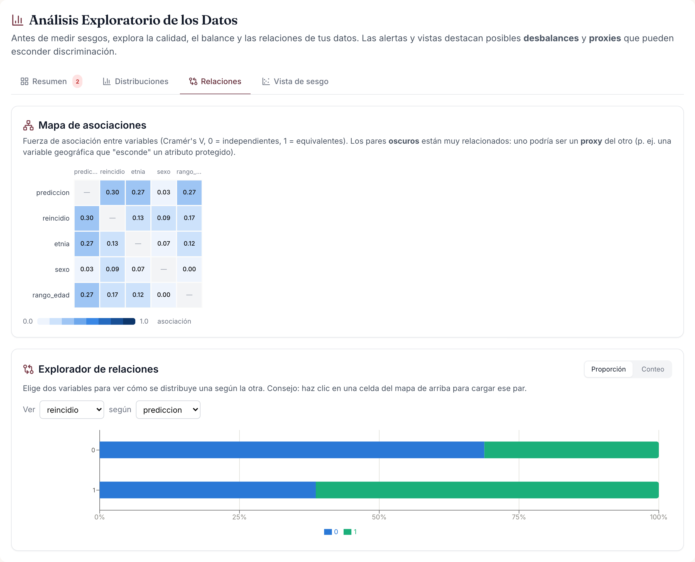

- El **mapa de asociaciones** mide la fuerza de relación entre cada par de
  variables (Cramér's V, de 0 = independientes a 1 = equivalentes).
- **Celdas oscuras = asociación fuerte = posible proxy.** Si una variable no
  protegida (p. ej. "comuna") aparece muy oscura junto a una protegida (p. ej.
  "etnia"), esa variable puede estar transmitiendo el sesgo de forma indirecta.
- Haz **clic en una celda** para cargar ese par en el **explorador de relaciones**
  de abajo, donde ves la relación como barras (por conteo o por proporción).

**En qué enfocarte:** cualquier par con V ≥ 0.5 merece atención. En el demo la
predicción (`prediccion`) está moderadamente asociada a `etnia` (≈0.27): una
primera señal de que el modelo se comporta distinto según la etnia.

### 6.4 Pestaña «Vista de sesgo»

La vista más directa para **anticipar inequidades**.

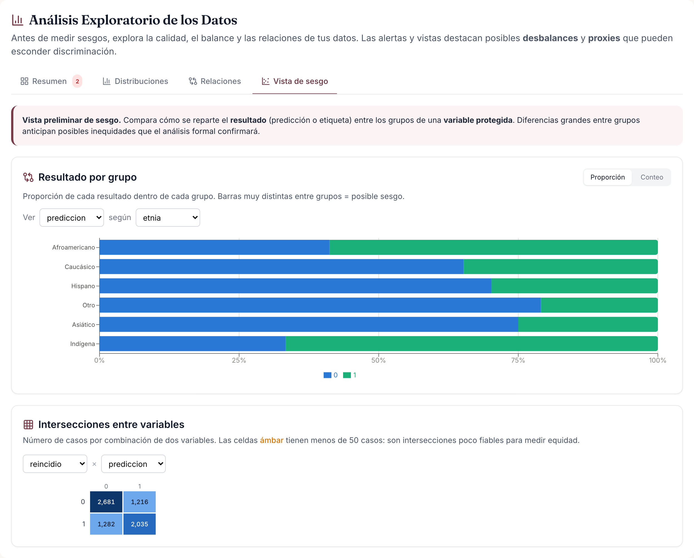

- **Resultado por grupo:** elige un *resultado* (la predicción o el valor real) y
  una *variable protegida*. Cada barra muestra, dentro de cada grupo, la
  proporción de cada resultado (apilado al 100%).
- **Barras muy distintas entre grupos = posible sesgo.** En el demo se ve
  clarísimo: el modelo **predice reincidencia** para el **58,8% de los
  Afroamericanos** frente al **29,8% de los Hispanos** o el **21,0% de "Otro"**.
  Esa brecha es la que el análisis formal va a cuantificar y evaluar.
- **Heatmap de intersecciones:** cruza dos variables por número de casos, para
  detectar celdas **intersectivas** diminutas (p. ej. "mujeres asiáticas"), poco
  fiables para medir equidad.

**En qué enfocarte:** esta pestaña te dice *dónde mirar*. Si aquí ya ves una
brecha grande, en el análisis de equidad muy probablemente saldrá "No Equitativo".

---

## 7. Paso 3 — Configuración del análisis

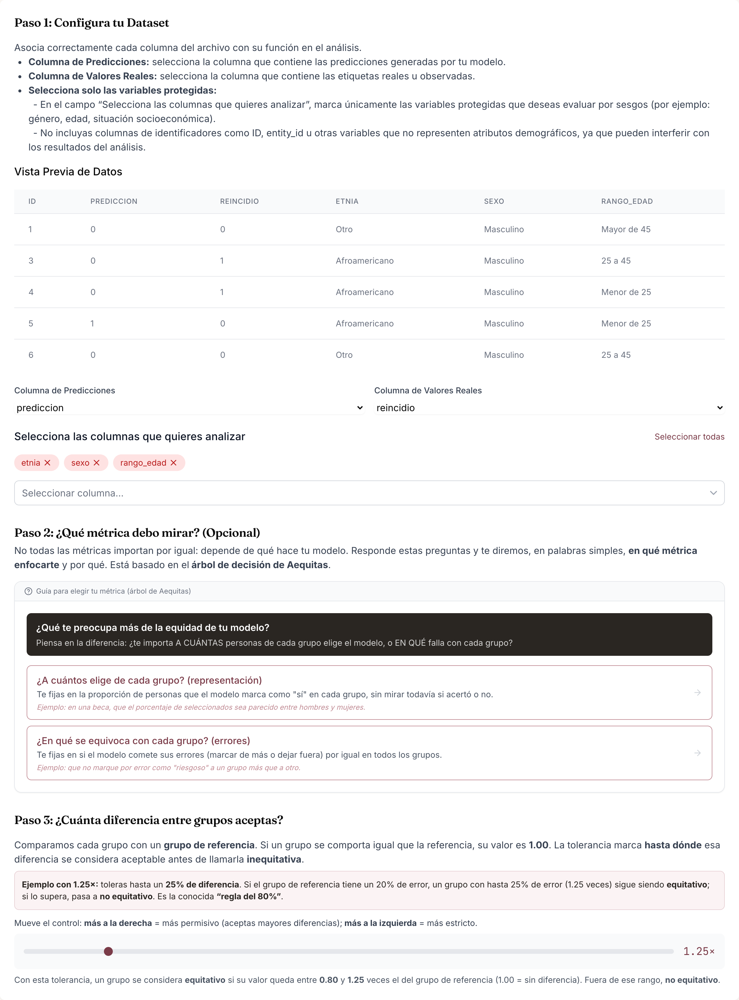

Bajo el EDA aparece la configuración. Tres cosas que definir:

**a) Columnas** (Paso 1 en pantalla):
- **Predicciones del modelo** → en el demo, `prediccion`.
- **Valores reales** → `reincidio`.
- **Variables protegidas** → `etnia`, `sexo`, `rango_edad` (puedes elegir varias).
  No incluyas la columna `id`.

**b) ¿Qué métrica debo mirar?** (Paso 2, opcional): un **asistente interactivo**
(basado en el árbol de decisión de Aequitas) que, respondiendo preguntas en
lenguaje simple, te sugiere **en qué métrica enfocarte** y por qué. Primero
distingue si te importa la **representación** (a cuántos elige de cada grupo) o
los **errores** (en qué se equivoca); si son errores, si la predicción positiva
**perjudica** (contexto punitivo → FPR/FDR) o **ayuda** (asistencial → FNR/FOR/TPR).
Cada opción trae un ejemplo. Al final indica la **métrica principal** y las demás
del mismo contexto a vigilar. Verás el árbol completo en la
[sección 10](#10-guía-de-métricas-cuándo-usar-cada-una).

**c) ¿Cuánta diferencia entre grupos aceptas?** (Paso 3, la tolerancia): un
multiplicador **`×`**. Cada grupo se compara con un **grupo de referencia**; si se
comportan igual, su valor es **1.00**. La tolerancia marca hasta dónde esa
diferencia se considera aceptable.
- `1.25×` (por defecto) = la clásica **"regla del 80%"**: se tolera hasta un 25% de
  diferencia. *Ejemplo:* si la referencia tiene 20% de error, un grupo con hasta
  25% de error (1.25×) sigue siendo equitativo; por encima, "no equitativo".
- La ayuda muestra la **banda de equidad**: con `1.25×`, equitativo si la
  disparidad está entre **0.80 y 1.25**. Mover el control a la **derecha** = más
  permisivo; a la **izquierda** = más estricto.

Pulsa **"Analizar Modelo"**. Aparecen dos pestañas de resultados: **Análisis de
Sesgos** y **Análisis de Equidad**.

---

## 8. Paso 4 — Análisis de Sesgos

Responde: **¿cómo se desempeña el modelo en cada subgrupo, por separado?** Aquí
**todavía no se compara** entre grupos; solo se miden las tasas de cada uno.

### 8.1 Tablas

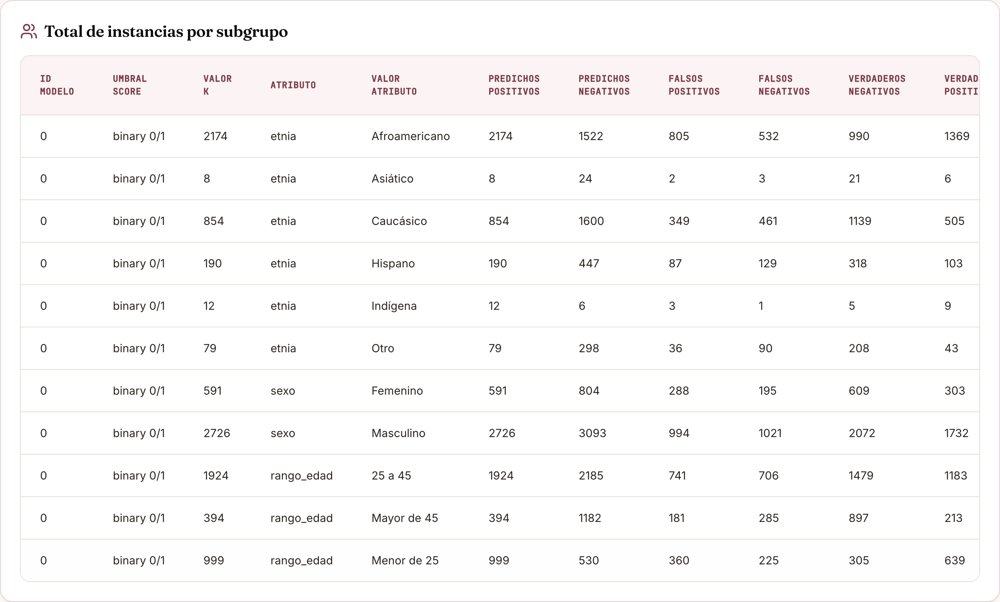

> Consejo: desliza la tabla horizontalmente para ver todas las columnas.

**Tabla "Total de instancias por subgrupo"** — los conteos crudos por subgrupo.
Es la base: aún no mide sesgo, sirve para entender volumen y balance.

| Columna | Qué significa |
|---|---|
| **Atributo / Valor del Atributo** | La variable protegida y el subgrupo. |
| **Predichos Positivos (PP)** | A cuántas personas el modelo predijo "positivo" (VP + FP). |
| **Predichos Negativos (PN)** | A cuántas predijo "negativo" (VN + FN). |
| **Falsos Positivos (FP)** | Marcadas como positivas por error (eran negativas). |
| **Falsos Negativos (FN)** | Positivas que el modelo no detectó. |
| **Verdaderos Negativos (VN)** / **Verdaderos Positivos (VP)** | Aciertos en negativos / positivos. |
| **Etiquetas Positivas / Negativas del Grupo** | Cuántas eran **realmente** positivas / negativas. |
| **Tamaño Grupo** | Total de personas en el subgrupo. |
| **Total Entidades** | Total en toda la variable protegida. |
| *ID Modelo · Umbral Score · k* | Columnas técnicas internas; puedes ignorarlas. |

*¿Qué mirar?* El **Tamaño Grupo** (para detectar subgrupos pequeños, <50, poco
fiables) y el balance de casos positivos reales.

**Tabla "Métricas de error para cada subgrupo"** — convierte los conteos en
**tasas** (0 a 1) para poder comparar grupos de distinto tamaño.

| Métrica | Fórmula (en palabras) | Qué responde |
|---|---|---|
| **Exactitud** | aciertos / total | ¿Qué proporción acertó en el subgrupo? |
| **TPR — Sensibilidad/Recall** | VP / (VP+FN) | De los positivos reales, ¿a cuántos detectó? |
| **TNR** | VN / (VN+FP) | De los negativos reales, ¿a cuántos identificó bien? |
| **FPR — Falsos Positivos** | FP / (FP+VN) | De los que **no** eran positivos, ¿a cuántos marcó por error? |
| **FNR — Falsos Negativos** | FN / (FN+VP) | De los positivos reales, ¿a cuántos se le escapó? |
| **FOR — Falsas Omisiones** | FN / (FN+VN) | De los marcados negativos, ¿cuántos eran positivos? |
| **FDR — Falsos Descubrimientos** | FP / (FP+VP) | De los marcados positivos, ¿cuántos estaban mal? |
| **NPV** | VN / (VN+FN) | De los marcados negativos, ¿cuántos acertó? |
| **Precisión (PPV)** | VP / (VP+FP) | De los marcados positivos, ¿cuántos acertó? |
| **PPR** | PP / Tamaño Grupo | ¿A qué fracción del grupo marcó como positivo? |
| **Prevalencia Predicha** | PP / total predichos | Peso del grupo entre los positivos predichos. |
| **Prevalencia** | Etiquetas Positivas / Tamaño Grupo | ¿Qué fracción era **realmente** positiva? |

*¿Qué mirar?* Compara **la misma métrica entre subgrupos**. Las 4 que deciden el
veredicto de equidad son **FPR, FNR, FOR y FDR** (las de error).

> Estas dos tablas son **absolutas**: describen a cada subgrupo por sí mismo y
> **no dependen del grupo de referencia** (ver [sección 9](#9-paso-5--análisis-de-equidad)).

### 8.2 Gráfico de valores absolutos

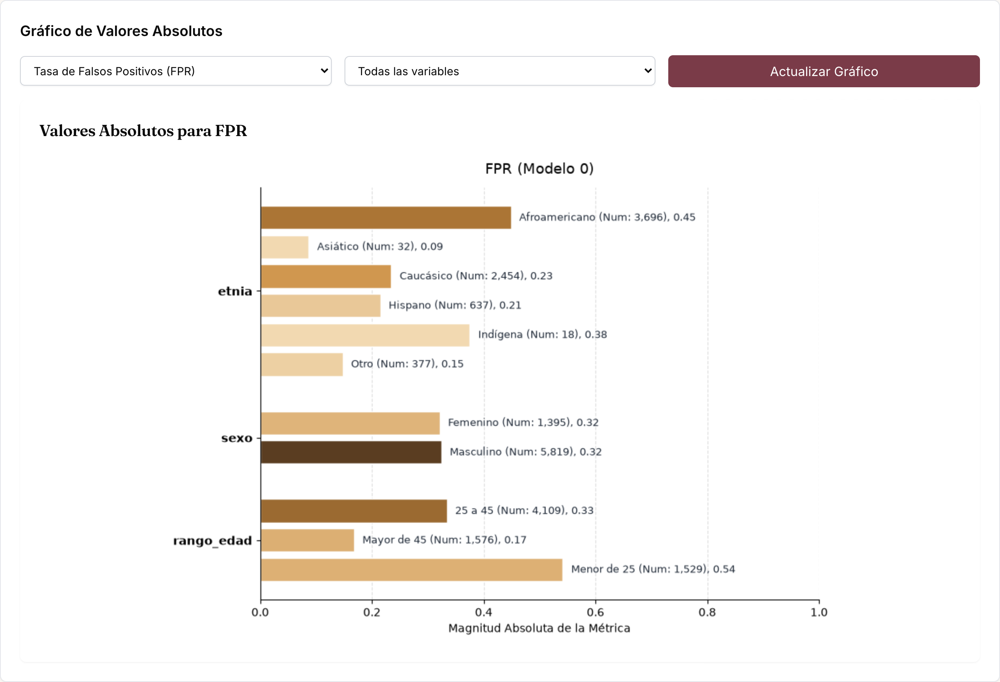

- Elige una **métrica** (p. ej. *Tasa de Falsos Positivos, FPR*) y una **variable**
  (o "Todas las variables").
- Cada barra es el **valor de esa métrica en un subgrupo**, agrupadas por atributo.
  La etiqueta muestra el valor y el tamaño del grupo (`Num`).
- El **color** codifica el tamaño del grupo (más oscuro = grupo más grande).

**Cómo leerlo (ejemplo real del demo):** la FPR de `etnia` es **0.45 en
Afroamericano**, **0.24 en Caucásico** y **0.15 en "Otro"**. Es decir: entre las
personas que **no** reincidieron, el modelo marcó erróneamente como "reincidente"
a casi la mitad de los afroamericanos, pero solo a ~1 de cada 7 del grupo "Otro".
Esa es la huella del sesgo — pero para juzgarla necesitamos compararla contra una
referencia, que es lo que hace la siguiente pestaña.

**En qué enfocarte:** identifica la métrica que más importa en tu caso (ver
[sección 10](#10-guía-de-métricas-cuándo-usar-cada-una)) y observa qué tan
distintos son sus valores entre grupos.

---

## 9. Paso 5 — Análisis de Equidad

Responde: **¿son justas esas diferencias?** Compara cada subgrupo con el grupo de
referencia y emite un veredicto.

### 9.1 Elegir el grupo de referencia

- **Grupo Mayoritario** (por defecto): el subgrupo con más casos (en el demo,
  Afroamericano en `etnia`).
- **Grupo con Mejor Desempeño:** el de menor error. **Ojo:** en este modo la
  referencia se elige **por cada métrica** (el mejor grupo en FPR puede no ser el
  mejor en FNR), así que puede **variar por métrica**.
- **Personalizado:** tú eliges el subgrupo de referencia (útil si hay un grupo de
  comparación definido por política).

**Vista previa antes de analizar.** Debajo de la selección de método, y **antes**
de pulsar *"Analizar Equidad"*, la herramienta muestra un recuadro **"Grupo de
referencia que se usará"** con el grupo elegido por atributo (p. ej. `etnia →
Afroamericano`). En *Mejor Desempeño* muestra el desglose por métrica. Así ves qué
referencia se aplicará antes de ejecutar.

Todas las disparidades se miden **respecto a ese grupo**, que por construcción
tiene disparidad **1.00** y aparece marcado con **"(ref)"** en la tabla de
disparidades. Tras analizar, el panel **"¿Contra qué se compara cada grupo?"**
confirma la referencia usada por atributo y el método aplicado.

> **¿Y si cambio el grupo de referencia?** Al cambiar el método y pulsar
> *"Analizar Equidad"* se actualizan **solo las cosas relativas**: la tabla de
> **disparidades**, el **gráfico de disparidad**, la marca **"(ref)"** y los
> **veredictos**. Las tablas absolutas (*Total de instancias* y *Métricas de
> error*) y la pestaña *Análisis de Sesgos* **no cambian**, porque los conteos y
> tasas de cada grupo no dependen de con quién se comparen. Si "no viste cambios",
> probablemente mirabas una tabla absoluta.

### 9.2 Tabla de disparidades y gráfico (treemap)

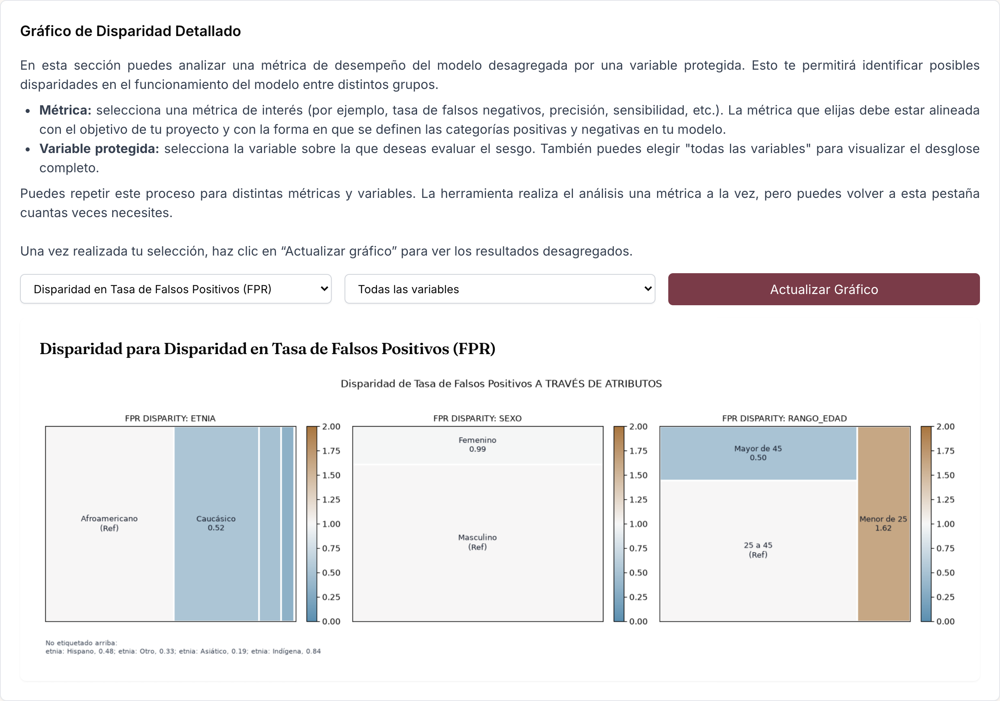

- La **tabla de disparidades** muestra, por métrica, el cociente
  `métrica_subgrupo / métrica_referencia`.
- El **treemap** ("gráfico de cuadros") visualiza esas disparidades: cada rectángulo
  es un subgrupo, coloreado por su disparidad en una escala que va de azul (bajo) a
  café (alto), centrada en 1.0. El grupo de referencia aparece marcado **"(ref)"**.
- Los subgrupos muy pequeños que no caben se listan como *"No etiquetado arriba"*.

**¿Cómo se calcula la disparidad?** Para cada métrica y subgrupo:

```
Disparidad(grupo) = Métrica(grupo) ÷ Métrica(grupo de referencia)
```

*Ejemplo real* (τ = 1.25, referencia = Afroamericano): FPR de Caucásico = 0.24;
FPR de Afroamericano = 0.45 → disparidad = 0.24 ÷ 0.45 = **0.52** (Caucásico tiene
alrededor de la mitad de falsos positivos que la referencia).

**Cómo leer una disparidad:**
- **= 1.00** → el subgrupo se comporta igual que la referencia.
- **> 1.00** → el subgrupo tiene **más** de esa métrica (más error, si la métrica es un error).
- **< 1.00** → el subgrupo tiene **menos**.

**Cómo leer el gráfico de disparidad (qué esperar y qué no):**
- **Sin sesgo:** todos los subgrupos **cerca de 1.00**, dentro de la banda
  equitativa (0.80–1.25 con τ = 1.25).
- **Señal de alerta:** cuadros **lejos de 1.00**. Valores altos (> τ) = el
  subgrupo sufre **más** de ese error; bajos (< 1/τ) = sufre menos (o la referencia
  está peor).
- **Lo que no deberías ver** en un modelo equitativo: disparidades grandes y
  sistemáticas (varias métricas fuera de rango) concentradas en un mismo grupo.
- Revisa **una métrica a la vez**, alineada con tu contexto (punitivo → FPR/FDR;
  asistencial → FNR/FOR).

### 9.3 Ajustar la tolerancia y recalcular

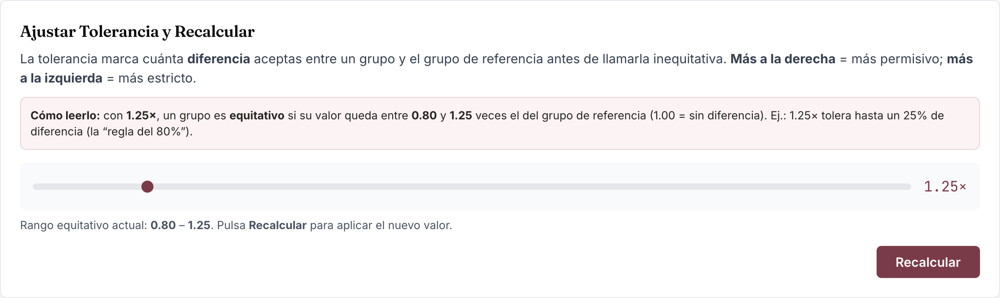

- Mueve el **slider de tolerancia** (formato `×`) y pulsa **"Recalcular"**. Verás la
  banda de equidad actualizada ("equitativo si la disparidad está entre 1/τ y τ").
- Subir la tolerancia hace el criterio más permisivo; bajarla, más estricto.

### 9.4 Resumen de Equidad y "¿Por qué estas conclusiones?"

- **Resumen de Equidad por Atributo:** un veredicto por variable protegida —
  **Equitativo** (verde) o **No Equitativo** (rojo). Un atributo es "No Equitativo"
  si **algún subgrupo fiable** supera la tolerancia en alguna de las métricas de
  error (FPR, FNR, FOR, FDR).
- **¿Por qué estas conclusiones?** — el panel más útil. Para cada atributo
  inequitativo, lista **qué subgrupos** lo causan, con la **métrica de mayor
  disparidad** y su valor, y **cuáles se excluyeron por muestra insuficiente**.

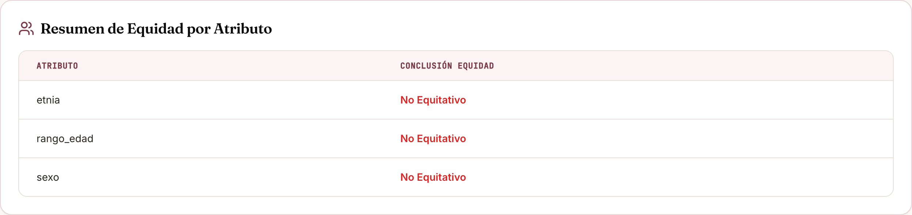

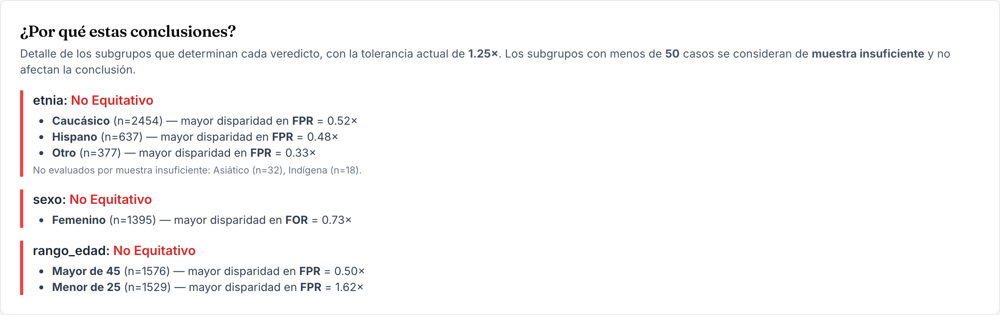

**Ejemplo real del demo** (tolerancia 1.25×, referencia mayoritaria):

| Subgrupo (etnia) | n | FPR | Disparidad FPR | ¿Cuenta? |
|---|---|---|---|---|
| Afroamericano (Ref) | 3.696 | 0.45 | 1.00 | — |
| Caucásico | 2.454 | 0.24 | **0.52** | sí → No Equitativo |
| Hispano | 637 | 0.22 | **0.48** | sí → No Equitativo |
| Otro | 377 | 0.15 | **0.33** | sí → No Equitativo |
| Asiático | 32 | 0.09 | 0.19 | **excluido** (muestra <50) |
| Indígena | 18 | 0.38 | 0.84 | **excluido** (muestra <50) |

Interpretación: `etnia` sale **No Equitativo** porque grupos reales (Caucásico,
Hispano, Otro) tienen tasas de falsos positivos muy por debajo del grupo de
referencia. Traducido: el modelo **marca erróneamente como reincidentes a los
afroamericanos con mucha más frecuencia** que a los demás. Los grupos diminutos
(Asiático, Indígena) se **excluyen** del veredicto porque sus tasas, con tan pocos
casos, no son fiables.

### 9.5 Test de Equidad Estadística por Atributo

Una tabla complementaria que muestra el veredicto **por cada tipo de paridad**
(no solo la conclusión global), útil para un análisis más fino.

---

## 10. Guía de métricas: cuándo usar cada una

No todas las métricas importan por igual: **depende de qué acción desencadena la
predicción de tu modelo**. El siguiente **árbol de decisión** (el mismo asistente
del Paso 2, en formato visual) resume cómo elegir la métrica en la que enfocarte:

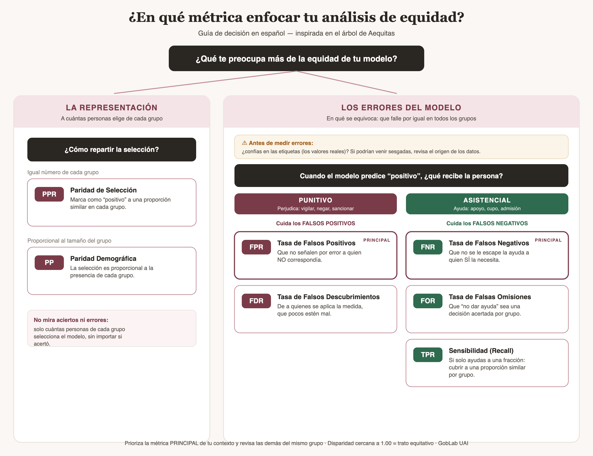

**Cómo usarlo:**

- **Representación** (a cuántos elige de cada grupo) → **PPR** (mismo número por
  grupo) o **Paridad Demográfica / Prevalencia Predicha** (proporcional al tamaño).
- **Errores · contexto punitivo** (la predicción positiva perjudica: vigilar,
  negar, sancionar) → **FPR** (principal) y **FDR**.
- **Errores · contexto asistencial** (la predicción positiva da un beneficio:
  apoyo, cupo, admisión) → **FNR** (principal), **FOR** y, si solo puedes atender a
  una fracción, **TPR**.

Como regla, primero pregúntate:

> **¿Un resultado "positivo" del modelo lleva a una acción PUNITIVA (vigilancia,
> negación, detención) o a un BENEFICIO (apoyo, recurso, admisión)?**

| Si te importa que… | Enfócate en | Definición | En el demo |
|---|---|---|---|
| No se **castigue de más** a un grupo (falsos positivos) | **FPR** (Tasa de Falsos Positivos) | De los que **no** eran positivos, cuántos marcó como positivos | Marcar "reincidente" a quien no reincide |
| Las intervenciones positivas sean **precisas** por grupo | **FDR** (Tasa de Falsos Descubrimientos) | De los marcados positivos, cuántos estaban mal | Detenidos preventivamente por error |
| No se **deje fuera** a un grupo que lo necesita (falsos negativos) | **FNR** (Tasa de Falsos Negativos) | De los que **sí** eran positivos, cuántos se le escaparon | No detectar a quien sí reincidirá |
| Un resultado negativo no **niegue un beneficio** injustamente | **FOR** (Tasa de Falsas Omisiones) | De los marcados negativos, cuántos eran realmente positivos | Clasificar como "seguro" a quien no lo era |
| La **cobertura** sea pareja | **TPR** (Sensibilidad) | De los positivos reales, cuántos detectó | — |
| La **tasa de selección** sea pareja | **Prevalencia predicha / PPR** | Proporción de positivos que predice por grupo | Paridad estadística / demográfica |

**Regla práctica de la herramienta:** el **veredicto global** de equidad se basa en
las cuatro métricas de **error** — **FPR, FNR, FOR, FDR** — porque son las más
relevantes para daños concretos y son independientes del tamaño del grupo. La
*Paridad Estadística* (PPR) se muestra aparte, pues depende mucho del tamaño de
cada grupo.

**Ejemplo de decisión (demo de reincidencia):** como una predicción positiva puede
llevar a una **medida punitiva**, la métrica más crítica es la **FPR** (no castigar
de más a un grupo por errores del modelo). Y efectivamente ahí aparece el sesgo.

---

## 11. Descargar el informe (PDF) y dar tu opinión

Al final de los resultados, la tarjeta **"Tu informe está listo"** genera un
**PDF** descargable con todo tu análisis, con la misma identidad visual de la
herramienta. El informe incluye:

1. **Página inicial — Análisis exploratorio (EDA):** panorama (filas, columnas,
   % de celdas faltantes, número de alertas), la tabla de **alertas de calidad y
   posibles sesgos** (con su nivel) y los **roles sugeridos** de las columnas.
2. **Métrica recomendada a observar:** si usaste el asistente del Paso 2, se
   destaca la métrica sugerida.
3. **Resumen del análisis:** registros, variables protegidas, tolerancia, método
   de **grupo de referencia** y tipo de modelo.
4. **Resumen de Equidad por Atributo** (Equitativo / No Equitativo).
5. **Grupo de referencia por atributo** (qué grupo se usó como base).
6. **Disparidades por atributo** (FPR/FNR/FOR/FDR), con la fila de referencia
   marcada **"(ref)"**.
7. **Gráficos** del análisis.

**Encuesta de satisfacción (opcional).** Al pulsar **"Descargar informe PDF"**
aparece una breve encuesta con dos opciones:
- **"Enviar y descargar":** envía tu valoración y descarga el PDF.
- **"Omitir y descargar":** descarga el PDF **sin** responder.

Tu opinión es anónima (salvo que dejes tu correo) y nos ayuda a mejorar. Para
comentarios o reportar errores en cualquier momento, usa el botón flotante
**"Enviar feedback"** (esquina inferior derecha).

---

## 12. Modelos multiclase

Si tu predicción/valor real tiene **más de dos categorías** (p. ej. riesgo
`Bajo` / `Medio` / `Alto`), la herramienta lo detecta y usa la estrategia
**"uno-contra-el-resto"**: evalúa cada clase por separado frente al resto.

- Aparece un **selector de clase** arriba de los resultados. Al cambiar de clase,
  todas las tablas y gráficos se actualizan a esa clase.
- Un **resumen global** indica, con badges, si cada atributo es inequitativo en
  **alguna** clase.

Todo lo demás (grupo de referencia, tolerancia, interpretación) funciona igual,
pero referido a la clase seleccionada.

---

## 13. En qué enfocarte: buenas prácticas y errores comunes

**Buenas prácticas**
- **Empieza por el EDA.** Si hay proxies o grupos diminutos, tenlo presente al leer los resultados.
- **Elige la métrica según el daño** que produce un error (sección 10), no midas todo a ciegas.
- **Usa el panel "¿Por qué estas conclusiones?"** para saber qué subgrupo y qué
  métrica están causando la inequidad. Ese es tu punto de acción.
- **Documenta la tolerancia elegida** (1.25× / regla 80% es un estándar razonable) y justifícala.
- **Trata los grupos con muestra insuficiente aparte:** no ignores que existen,
  pero recuerda que sus tasas son inestables.

**Errores comunes**
- Confundir **valores absolutos** (Análisis de Sesgos) con **disparidades**
  (Análisis de Equidad). El primero mide cada grupo solo; el segundo compara.
- Concluir "el modelo es justo" mirando solo la **precisión global**. Un modelo
  preciso en promedio puede ser muy inequitativo por grupos.
- Interpretar una disparidad <1 como "bueno". Significa **menos** de esa métrica en
  el subgrupo, lo que puede ser bueno o malo según la métrica (menos falsos
  positivos es bueno; menos verdaderos positivos es malo).
- Dejar que un grupo de 15 personas "decida" el veredicto. Por eso existe la
  **muestra mínima**.
- Incluir la columna **id** como variable protegida (tiene cardinalidad altísima y
  no aporta).

---

## 14. Preguntas frecuentes

**¿La herramienta guarda mis datos?** No. Los datos se procesan y se descartan; no
se almacenan.

**¿Por qué `etnia` sigue saliendo "No Equitativo" aunque suba mucho la
tolerancia?** Porque la disparidad es **real y grande** en grupos reales (no solo en
los pequeños). Usa el panel "¿Por qué?" para ver qué subgrupos la causan.

**¿Qué formato debe tener la predicción?** Binaria `0/1` para modelos de dos clases,
o varias categorías para multiclase. El valor real, en el mismo formato.

**¿Puedo evaluar varias variables protegidas a la vez?** Sí, selecciónalas todas en
la configuración; cada una recibe su propio veredicto.

**¿Qué significa "muestra insuficiente"?** Que ese subgrupo tiene menos casos que el
umbral (por defecto 50) y, por tanto, no se usa para decidir el veredicto (pero
sigue visible en las tablas).

---

*GobLab UAI — Escuela de Gobierno, Universidad Adolfo Ibáñez. Herramienta de apoyo
a la Ley N.º 20.609 y a la guía "Permitido Innovar".*
